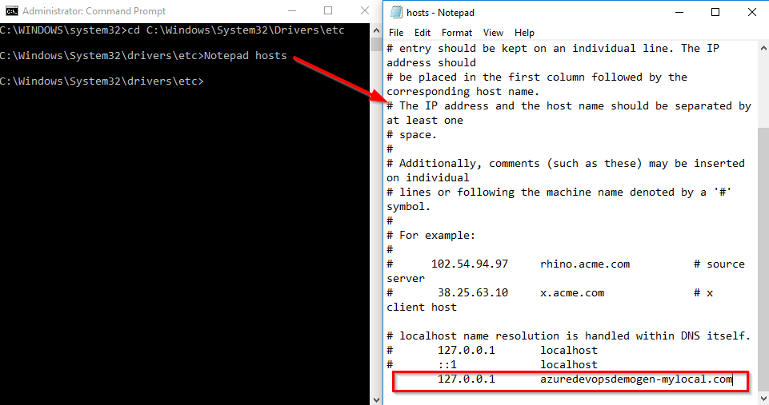
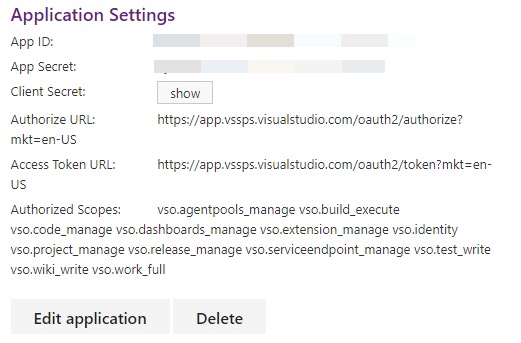
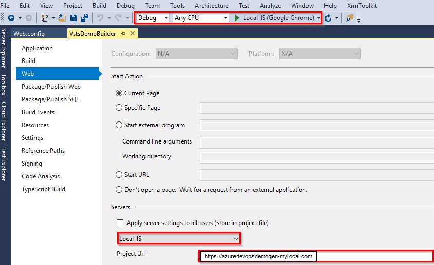
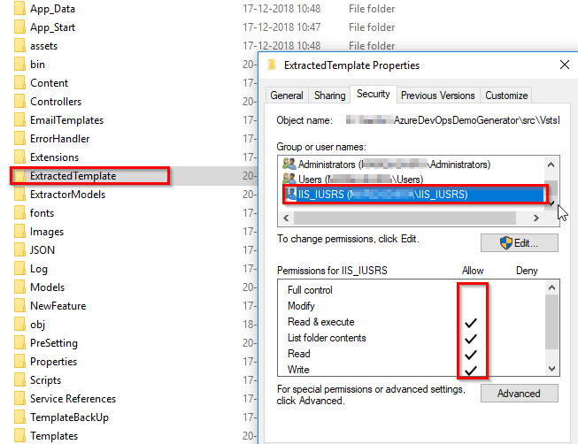

# DevOps Demo Generator

   

## About
Azure DevOps Demo Generator helps you create projects on your Azure DevOps organization  with pre-populated sample content that includes source code, work items, iterations, service endpoints, build and release definitions based on a template you choose.

The purpose of this system is to simplify working with the hands-on-labs, demos and other education material provided by Azure Marketing team.

## How to Run this application locally?

To run this locally, you will need:
 * Microsoft Visual Studio 2017 or higher;       
 * Internet Information Server and ASP.NET 4.5  or above installed;
 * SQL Server 2016 Express LocalDB

 1. Clone the solution to your local repository  or fork it to your GitHub repo and clone it from your repository. Open the solution in Visual Studio 2017 and restore the required packages.

    >This application uses **OAuth** for authorization. In order to register the app, you will need to provide a callback URL. However, App registration does not allow localhost (http) to be the hostname in your callback URL. You can edit the hosts file (C:\Windows\System32\Drivers\etc\hosts) on your local computer to map a hostname to 127.0.0.1. Then use this hostname when you register your app. 

1. Using an elevated command prompt, open the Hosts file on your machine and add a new mapping to your hostname. For instance, let's say we will use **azuredevopsdemogen-mylocal.com** domain name.

    > 127.0.0.1 azuredevopsdemogen-mylocal.com

    

1. You can register the app using this domain but you will need to provide a secure connection (https) for the callback URL. Create a new website **azuredevopsdemogen-mylocal.com** and enable HTTPS with a self-signed certificate on IIS by following the instructions provided in this [article](https://weblogs.asp.net/scottgu/tip-trick-enabling-ssl-on-iis7-using-self-signed-certificates)

1. Next, go to (https://app.vsaex.visualstudio.com/app/register) to register your app. Specify the domain name (**azuredevopsdemogen-mylocal.com**) for the **Application website** and the **Application Callback URL** must be `https://<<domain name>>/Environment/Create`

1. Select the following scopes and submit. If the submission is successful, the application settings page is displayed. You will need these information.

   

   

1. Go to IIS Manager, select the wesbiste you created. Open the  **Configuration Editor** by double-clicking it. Open the **Collections**. Add the following entries to the collection:

   * RedirectUri - `https://<<domain name>>/Environment/Create`
    * ClientId - App ID from the application settings
    * ClientSecret - Client Secret from the application settings
    * AppScope - Authorized Scopes from the application settings (Encode the Authorized scopes and copy)

    

   If you want to view the settings for the app that you registered, you can get it from [here](https://app.vssps.visualstudio.com/profile/view).

1. Open the solution in Visual Studio and run the application in debug mode. Make sure you are running using the Local IIS and not IIS Express.

   

## Extractor

When you are using extractor make sure you have given the Read & Write permissions for **IIS_IUSRS** group on the folder **ExtractedTemplate**

   
